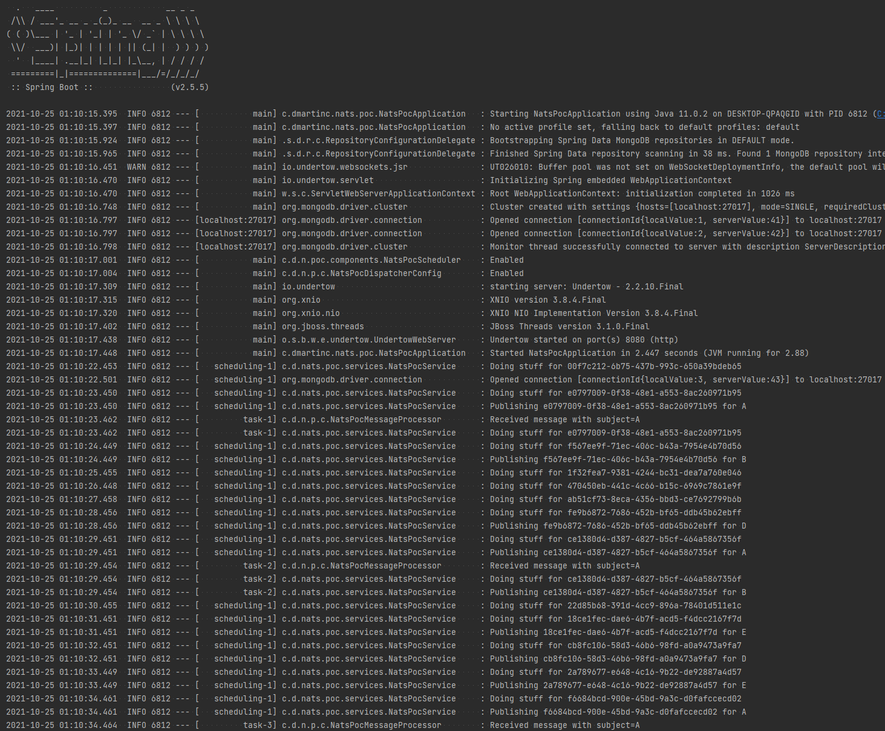
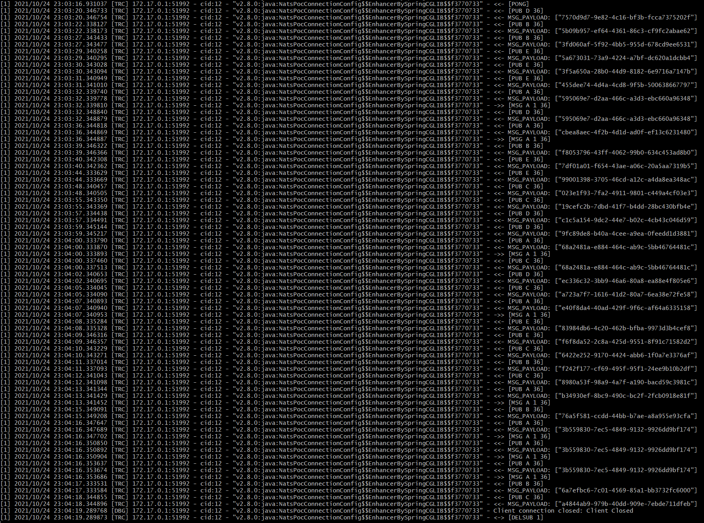
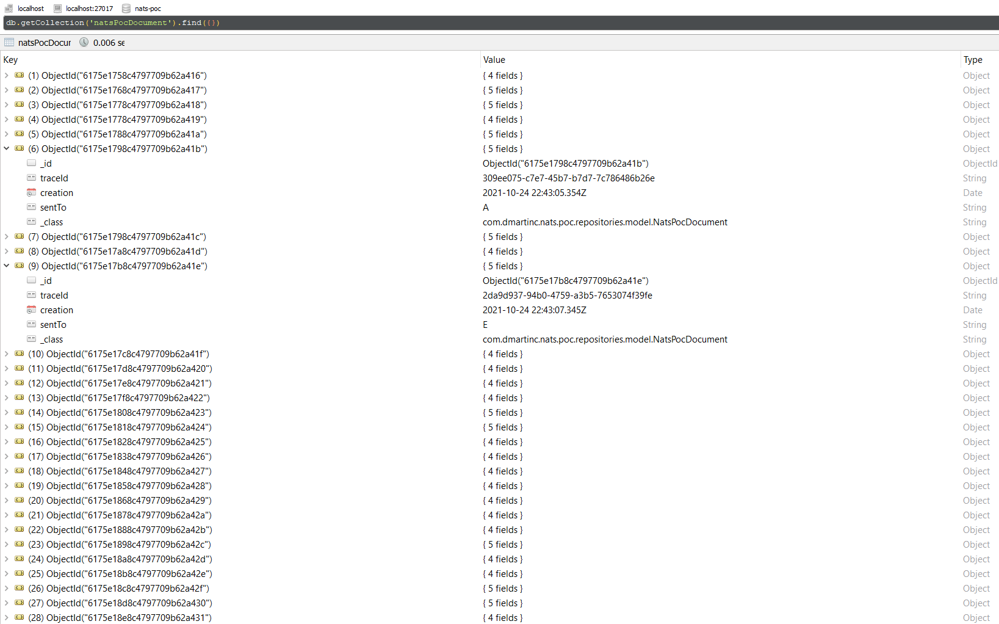

# NATS Proof of concept
This simple gradle project presents a proof of concept of microservices communicating through a NATS server.

Every instance of this application can be configured to and/or not to:
* Start a scheduler which, with a fixed rate time, triggers the `doStuff` method of the application service
* Start a NATS dispatcher which listens (in a queue way) for one topic and, every time it gets a message from that topic, triggers the `doStuff` method of the application service

At the moment, every time the `doStuff` method of the application service gets executed: 
* It may send (50% chance) a nats message to one of the configured topics
* It stores the message in the mongo repository

This application can be run as standalone, but the idea is to deploy several replicas for each topic and create a network of instances of the same application. For that use case, take a look at the [k8s README](k8s/README.md). 

You can take a look at the [roadmap file](ROADMAP.md) for my next steps with this project.

## Compilation
This project is built with gradle. It is recommended to use the gradle wrapper provided with the project.

**[JDK 11](https://jdk.java.net/archive/)** is needed.

For compiling the project, you can use this: 
```shell
./gradlew clean build
```

## Before Execution

### Mongo requirement
If you do not have a mongo server running you can easily run it with docker with this:
```shell
docker run --memory=512m --name mongo \
    -p 27017:27017 \
    --restart unless-stopped \
    -d mongo
```
These are the standard mongodb properties to edit in case of need:
```properties
spring.data.mongodb.database=nats-poc
spring.data.mongodb.host=localhost
spring.data.mongodb.port=27017
```

### Nats requirement
If you do not have a NATS server running you can easily run it with docker with this:
```shell
docker run --memory=512m --name nats \
    -p 4222:4222 \
    -p 6222:6222 \
    -p 8222:8222 \
    --restart=unless-stopped \
    -d nats -DV
```

## Execution
```shell
./gradlew bootRun
```

### Once it is running
Once the server is running (with the default properties) you can:
* Take a look at the application logs and the ingoing and outgoing communications
  
* Take a look at the nats server log
  
* Check the stored documents at the MongoDB
  