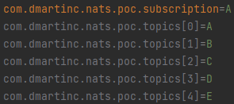

# NATS Proof of concept on Kubernetes

## Docker image generation
First, we need to build the docker image to be deployed on Kubernetes. 
```shell
> ./gradlew docker
```
This will generate a local image called `nats-poc:$projectsVersion`

## Namespace creation
```shell
$ kubectl create ns nats-poc
namespace/nats-poc created
```
## Backend deployment
We need to deploy the mongo and the nats servers
```shell
$ kubectl apply -k ./k8s/backend
configmap/nats created
service/mongo created
service/nats created
deployment.apps/mongo created
deployment.apps/nats created
```

## App instances deployment
We deploy 2 replicas for 5 different listeners and 1 for the scheduler
```shell
$ kubectl apply -k ./k8s/apps
configmap/nats-poc-a created
configmap/nats-poc-b created
configmap/nats-poc-c created
configmap/nats-poc-d created
configmap/nats-poc-e created
configmap/nats-poc-scheduler created
deployment.apps/nats-poc-a created
deployment.apps/nats-poc-b created
deployment.apps/nats-poc-c created
deployment.apps/nats-poc-d created
deployment.apps/nats-poc-e created
deployment.apps/nats-poc-scheduler created
```

## All set
All pods are up and running:


This is a screenshot of how the application replicas logs look like:


And this is a screenshot of how the NATS server log looks like:


## Destroying all resources
You can play with the resources as much as you want:
* Scale down/up the scheduler and check in the logs if there are more messages circulating the nats net
* Add more replicas to some deployments
* Configure several execution scenarios by configuring the subscription properties: 

  

If you want to delete every kind deployment on kubernetes you can delete the namespace with one single command:
```shell
$ kubectl delete ns nats-poc
namespace "nats-poc" deleted
```